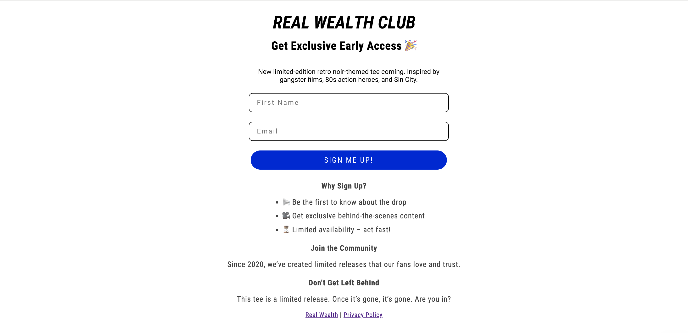

# Landing Page for Real Wealth Club

## Overview

### Screenshot



### Links

- Live Page URL: [Live Page](https://therwc.org/pages/join-our-vip)
- Brands URL: [Real Wealth Club](https://therwc.org)


This landing page is designed for use with an embedded Klaviyo form on Shopify. It serves as a promotional tool aimed at capturing leads by informing users to join the mailing list for updates on the upcoming launch. Traffic is primarily driven to this page via Facebook ads.

## Purpose

The primary goals of this landing page is to:

- **Promote Upcoming Launch:** Inform users about the upcoming product launch and encourage them to join the mailing list.
- **Capture Leads:** Grow the email subscriber list by capturing leads from interested users.
- **Encourage User Engagement:** Provide exclusive content and offers to increase user interaction.

## Features

- **Hidden Elements:** To maintain focus on the main content and call to action, elements like the header, footer, rotating promo bar, and newsletter section are hidden.
- **Responsive Design:** The logo and content adapt seamlessly across different devices, ensuring a consistent user experience.
- **Centered Content:** The logo, title, and promotional text are centered to capture and hold the user's attention.
- **Clear Call to Action:** Bold titles and well-structured content guide users toward the desired action.

## Details of Implementation

### HTML and CSS Customization

- **Hide Unnecessary Elements:** CSS styles are applied to hide the header, footer, rotating promo bar, and newsletter section.

  ```css
  #header, .header, header { display: none !important; }
  #footer, .footer, footer { display: none !important; }
  #rotating-promo-bar, .rotating-promo-bar, rotating-promo-bar { display: none !important; }
  .newsletter_section { display: none; }

- **Main Content Styling:** The main content is centered with added padding for better readability. A minimum height is set to ensure the content occupies the full viewport height.
- **Responsive Logo:** The logo's size adjusts based on the screen width for optimal display.

```css
.twelve.columns.offset-by-two.page.clearfix img {
    width: 50%;
    max-width: 300px;
    margin-top: 10px;
    margin-bottom: 1rem;
}

@media screen and (min-width: 750px) {
    .twelve.columns.offset-by-two.page.clearfix img {
        width: 90%;
    }
}
```


- **Spacing Adjustments:** Margins are set for paragraphs and bold titles to ensure consistent and visually appealing spacing.

### Content Structure

- The page features a centered logo followed by the page title.
- The main content area includes promotional text, structured with bold titles and paragraphs for clear communication.
- Links to the company's website and privacy policy are included at the bottom of the page.

## Usage

This landing page is designed to be integrated into a Shopify store with an embedded Klaviyo form for capturing email leads. It is versatile for use in various promotional campaigns aimed at driving specific user actions and enhancing conversion rates.
